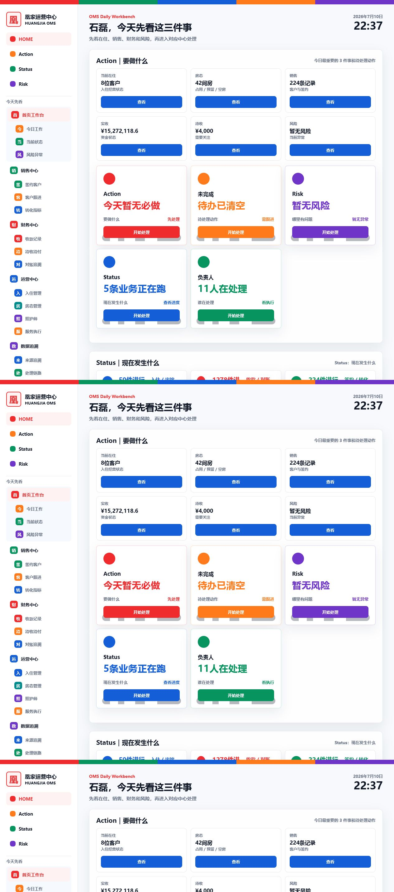

# EMP001 石磊工作台二次内测报告

日期：2026-07-10

验收身份：EMP001 石磊

验收结论：**FAIL**

验收目标：判断老板打开 OMS 后，是否可以直接完成日常经营查看、查询、下钻和追溯。

## 一、入口验收

| 项目 | 实测结果 | 状态 |
|---|---|---|
| 当前入口 | `http://127.0.0.1:8787/`，通过 SSH tunnel 连接生产服务器 | 模拟入口 |
| 前端资源版本 | `pre-domain-workbench-20260710` | 已加载最新版本 |
| 当前 Git 基线 | `74cb488884770228cef4635e1ec5e9f2c085101a`，工作区另有未提交前端修改 | 未冻结 |
| 当前 API | `http://127.0.0.1:8787/api/oms/*` | 仅当前机器可访问 |
| 当前数据源 | 服务器 `/var/lib/huangjia-oms/truth_source`，API 标记 `OMS_TRUTH_SOURCE` | 真实数据 |
| 缓存 | `index.html`、`app.js` 均返回 `Cache-Control: no-store`；资源 URL 带版本号 | 未发现旧缓存 |
| 页面启动 | `auth=authenticated`、`appMount=ready`、`uiChain=ready` | PASS |

当前加载资源：

- `oms-config.dev.js?v=pre-domain-workbench-20260710`
- `oms-config.prod.js?v=pre-domain-workbench-20260710`
- `oms-config.js?v=pre-domain-workbench-20260710`
- `app.js?v=pre-domain-workbench-20260710`
- `styles.css?v=pre-domain-workbench-20260710`

前端文件 SHA256：

| 文件 | SHA256 |
|---|---|
| `app.js` | `EBC5A05E74E0B5B9C1AE99BAB8212BCEC876C7A256246C5D0B41067F2F21A9F9` |
| `contract.json` | `A74D71EA22B457652CD25057EE7D66C6681FD0F0BAFD6A602E3188C416EA6652` |
| `index.html` | `A65B92A61581FC5F925CE519AF51A7E0A8EBC6355A43ACB961816E37ED1B2AAB` |
| `styles.css` | `9C6669386E3CFA6AD68A2BE67FFA3801BF85274277C0B5396BBFCDD4BFDAB3D3` |

浏览器实测截图：



## 二、一级菜单验收

| 一级菜单 | 页面加载 | 数据加载 | 结论 |
|---|---|---|---|
| 首页工作台 | 成功 | 成功 | PARTIAL |
| 销售中心 | 成功 | 销售 224、合同 224 | PARTIAL |
| 财务中心 | 成功 | 总数 1278，页面仅加载 500 | FAIL |
| 运营中心 | 成功 | 房态 42、Stay 172，页面仅展示 12 条 | FAIL |
| 数据追溯 | 成功 | 5 组来源、24 条按需追溯数据 | PARTIAL |
| AI 助手 | 当前菜单不存在 | 不适用 | NOT PRESENT |

## 三、二级菜单验收

### 首页工作台

- 今日工作
- 当前状态
- 风险异常

### 销售中心

- 签约客户
- 客户跟进
- 转化指标

### 财务中心

- 收款记录
- 待收待付
- 对账追溯

### 运营中心

- 入住管理
- 房态管理
- 照护师
- 服务执行

### 数据追溯

- 来源追溯
- 处理链路
- 历史查询

二级菜单与 `contract.json → workspace_menu_profiles.boss` 和冻结的老板菜单结构一致。问题在于多个二级菜单仍复用同一个中心页面，没有形成独立筛选结果。

## 四、首页工作台验收

| 经营项 | 页面显示 | API / Truth Source | 结果 |
|---|---:|---:|---|
| 在住数量 | 8 位客户 | 8，`stay.json` | PASS |
| 房态数量 | 42 间房 | 42，`room.json` | PASS |
| 销售数量 | 224 条 | 224，`sales.json` | PASS |
| 实收 | ¥15,272,118.6 | 15,272,118.6，Finance Domain | PASS |
| 待收 | ¥4,000 | 4,000，Finance Domain | PASS |
| 待付 | 未显示 | 276,993.08，Finance Domain | FAIL |
| 风险事项 | 暂无风险 | 0，Home risk summary | PASS |

使用判断：首屏可以快速看经营摘要，但缺少待付；“11 人在处理”与 4 个岗位仍待真实 user_id 绑定不一致；1278 条财务事件和 224 条销售记录被描述为“进行中”，容易被误解为当前工作量。

## 五、销售中心验收

页面总数：

- 销售记录：224。
- 合同记录：224。
- 页面可见记录：224。

固定随机种子 `20260710` 抽样 10 条：

| 记录 | 客户 | 合同 | 金额 | 已收 | 未收 | 销售人员 | Excel 行 |
|---|---|---|---:|---|---|---|---:|
| SALES-FENGZHI-R0047 | 石悦 | SALES-FENGZHI-R0047 | 3,045 | 缺失 | 缺失 | 刘芳羽 | 47 |
| SALES-INNER-R0176 | 常爽 | NSEKI94131110 | 19,990 | 缺失 | 缺失 | 刘芳羽 | 176 |
| SALES-INNER-R0187 | 万欣 | NSEKI94131124 | 20,990 | 缺失 | 缺失 | 杨欢欢 | 187 |
| SALES-FENGZHI-R0016 | 钱坤羽 | SALES-FENGZHI-R0016 | 6,090 | 缺失 | 缺失 | 刘芳羽 | 16 |
| SALES-INNER-R0042 | 王羚艺 | NSEKI94130984 | 22,990 | 缺失 | 缺失 | 杨欢欢 | 42 |
| SALES-INNER-R0149 | 常琳 | NSEKI94131088 | 26,290 | 缺失 | 缺失 | 刘芳羽 | 149 |
| SALES-INNER-R0084 | 王曼丽 | NSEKI94131026 | 24,290 | 缺失 | 缺失 | 杨欢欢 | 84 |
| SALES-INNER-R0106 | 徐玮佳 | NSEKI94131047 | 25,290 | 缺失 | 缺失 | 杨欢欢 | 106 |
| SALES-INNER-R0060 | 白雪 | NSEKI94131001 | 25,000 | 缺失 | 缺失 | 杨欢欢 | 60 |
| SALES-FENGZHI-R0042 | 张女士 | SALES-FENGZHI-R0042 | 3,000 | 缺失 | 缺失 | 杨欢欢 | 42 |

来源文件均为：`2026年销售明细表（经验为王7.10）.xlsx`。

浏览器核对：10/10 客户名称可在页面找到。页面卡片只显示客户、合同、金额及来源行，没有显示已收、未收和销售人员。Truth Source 的这 10 条记录本身也没有 `paid_amount`、`unpaid_amount` 字段。

结论：销售列表可浏览，但不能完成合同收款判断，销售经营验收失败。

## 六、财务中心验收

API 指标：

| 指标 | API 值 | 页面 |
|---|---:|---|
| 财务事件 | 1278 | 显示总数 1278，但仅加载 500 |
| 收入 | ¥15,272,118.6 | 显示 |
| 支出 | ¥7,589,371.94 | 未显示 |
| 利润 | ¥7,682,746.66 | 未显示 |
| 待收 | ¥4,000 | 显示 |
| 待付 | ¥276,993.08 | 未显示 |

抽样 10 条来源核对：

| financial_event_id | 类型 | 金额 | 来源 Sheet / 行 |
|---|---|---:|---|
| FIN-02-1-R0076-IN | income | 13,962.02 | 2月 / 76 |
| FIN-01-1-R0110-OUT | expense | 5,000 | 2026.1月 / 110 |
| FIN-04-1-R0078-IN | income | 5,000 | 4月 / 78 |
| FIN-04-2-R0006-IN | income | 2,646 | 4月 / 6 |
| FIN-06-1-R0023-IN | income | 23,290 | 6月 / 23 |
| FIN-02-1-R0016-IN | income | 8,000 | 2月 / 16 |
| FIN-04-1-R0042-IN | income | 5,000 | 4月 / 42 |
| FIN-06-1-R0059-IN | income | 10,000 | 6月 / 59 |
| FIN-06-1-R0122-IN | income | 20,990 | 6月 / 122 |
| FIN-02-1-R0048-OUT | expense | 2,000 | 2月 / 48 |

来源文件均为：`2026年财务报表（7月）.xlsx`。

浏览器核对：页面没有显示 `financial_event_id`；只展示前 500 条且没有搜索、筛选或分页，抽样中的后段记录无法从页面访问。因此无法完成 10/10 精确核对。

## 七、运营中心验收

API 总数：

- 房态：42。
- Stay：172。
- 当前在住：8。
- 照护师：暂无结构化生产数据。

房态抽样 10 条：

| 房间 | 状态 | 当前客户 | Excel 行 | 页面可见 |
|---|---|---|---:|---|
| 标准房206阳 | AVAILABLE | - | 50 | 否 |
| 302北双卫 | RESERVED | 王羚艺 | 13 | 是 |
| 510南单卫 | RESERVED | 徐丽斯 | 39 | 否 |
| 3A05北双卫 | OCCUPIED | 周艳飞 | 24 | 否 |
| 3A11南双卫 | RESERVED | 于淼 | 29 | 否 |
| 309北单卫 | RESERVED | 李俊 | 17 | 否 |
| 301南双卫 | RESERVED | 兰澜 | 12 | 是 |
| 209南双卫 | OCCUPIED | 周璘梦 | 7 | 是 |
| 3A09南双卫 | RESERVED | 谭晨昱 | 27 | 否 |
| 标准房208阳 | AVAILABLE | - | 46 | 否 |

房态来源：`①凰家母婴 2021房态表June(1).xlsx`。

Stay 抽样 10 条：王薇、王丽鑫、朱虹、郭莹莹、穆玺竹、刘馨悦、王姝婷、赵记彤、李好、孙晓旭。

来源包含：`A  凰家母婴签约客户一览表（挤牙膏）(1).xlsx`。

浏览器核对：运营中心只展示合并结果中的前 12 条房间记录，房态样本仅 3/10 可见，Stay 样本 0/10 可见。页面无搜索、筛选、分页或 Stay 独立列表。

## 八、二级菜单与按钮验收

| 能力 | 实测结果 |
|---|---|
| 查看 | 有“查看”“查看处理”按钮 |
| 筛选 | 无 |
| 搜索 | 无 |
| 详情 | 无独立只读详情入口；“查看处理”进入通用动作链 |
| 追溯 | 数据追溯页有 24 个折叠明细，但不显示业务事件 ID |
| 分页 | 无 |
| 员工录入按钮 | 未发现 |
| 无权限操作 | 未发现明确员工录入控件，但通用“查看处理”语义不够安全明确 |

## 九、飞书模拟验收

模拟路径：

```text
当前电脑
→ SSH tunnel
→ 127.0.0.1:8787
→ Local Owner Access
→ EMP001 工作台
```

结果：

- 页面加载：PASS。
- 身份绑定：PASS，`workspace=boss`。
- 一级菜单跳转：PASS。
- 二级菜单显示：PASS。
- 真实数据摘要：PARTIAL。
- 明细经营操作：FAIL。
- 飞书 H5 Runtime：未实际覆盖。
- 公网 HTTPS：未覆盖。

本次只能证明当前机器模拟入口可加载，不能替代飞书客户端生产验收。

## 十、阻塞项

| 编号 | 阻塞项 | 风险 |
|---|---|---|
| EMP001-UAT-001 | 首页缺少待付金额 | 高 |
| EMP001-UAT-002 | 销售记录缺少已收/未收，页面不显示销售人员 | 高 |
| EMP001-UAT-003 | 财务缺少支出、利润、待付；778 条记录无法从页面访问 | 高 |
| EMP001-UAT-004 | 财务页面不显示 financial_event_id，无法精确追溯 | 高 |
| EMP001-UAT-005 | 运营页面只展示 12 条房间记录，172 条 Stay 无法访问 | 高 |
| EMP001-UAT-006 | 销售、财务、运营均无搜索、筛选和分页 | 高 |
| EMP001-UAT-007 | “进行中”把记录总数当成当前工作量，经营语义失真 | 高 |
| EMP001-UAT-008 | “11 人在处理”与 4 个岗位待真实 user_id 绑定不一致 | 中 |
| EMP001-UAT-009 | 当前仍是 tunnel 模拟，不是飞书 H5 + 公网 HTTPS | 阶段阻塞 |

## 十一、最终判断

```text
入口可打开 = YES
经营摘要可看 = PARTIAL
关键明细可查 = NO
数据可完整追溯 = NO
老板可每日依赖 = NO
验收结论 = FAIL
```

当前系统可以让老板看到一部分真实经营数字，但还不能支持日常经营核对、筛选、下钻和追溯，因此暂不具备“老板愿意每天打开并依赖”的产品条件。

本轮只记录问题，没有修复以上阻塞项。
