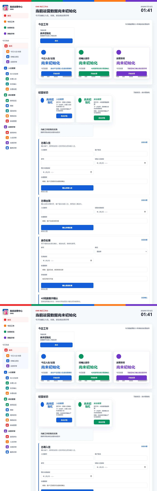

# EMP008 刘芳羽工作台 V1 开发报告

## 1. 版本状态

- 验收版本：`emp008-workbench-v1-20260712-2`
- 员工：EMP008 刘芳羽
- 岗位：店总 + 销售
- 当前阶段：验收环境已部署，等待石磊飞书电脑端与手机端反馈
- 正式发布：未批准

## 2. 完成模块

### 首页

- 今日入住/出馆
- 待确认房态
- 运营异常
- 当前没有生产事实时显示“当前运营数据尚未初始化”
- 旧经营数据不进入当前工作台

### 入住管理

- 待入住安排入口
- 办理入住表单
- 在住确认入口
- 办理出馆表单
- 办理入住同步生成当前入住并占用房间
- 办理出馆同步退出当前入住并将房间转为清洁中

### 房态管理

- 42 间房基础资源
- 房间总览入口
- 调房入口
- 清洁状态
- 维修状态
- 停用管理
- 入住中房间必须绑定当前入住

### 运营异常

- 房间冲突
- 入住异常
- 出馆异常
- 服务异常

## 3. 身份与权限

- 身份链：飞书用户 ID → EMP008 → 刘芳羽 → 店总 + 销售 → 店总工作台
- 办理入住、办理出馆和房态处理仅允许 EMP008 店总权限
- 所有写入动作记录原因、审计和事件
- 查看动作不修改经营事实
- 未接入销售中心、财务模块或老板驾驶舱

## 4. 操作流程

### 首次初始化

1. 刘芳羽确认 42 间房真实状态。
2. 系统生成当前房态。
3. 刘芳羽逐条确认此刻真实在住。
4. 系统生成当前入住。

### 日常办理入住

1. 选择客户和可用房间。
2. 填写实际入住时间与办理原因。
3. 权限校验通过。
4. 生成当前入住，房间同步变为入住中。
5. 写入审计并发布事件。

### 日常办理出馆

1. 选择当前入住记录。
2. 填写实际出馆时间与办理原因。
3. 客户退出当前入住。
4. 房间同步进入清洁中。
5. 写入审计并发布事件。

## 5. 页面截图

### 电脑端验收

### 手机端验收

## 6. 数据与接口验证

- 刘芳羽身份：EMP008 / `june`
- 当前经营状态：尚未初始化
- 房间基础资源：42/42
- 验收后端 release：`emp008-v1-validation-20260712-0140`
- 验收前端提交：`32a5e2f`
- 前端静态资源版本：`emp008-workbench-v1-20260712-2`

## 7. 自动验收结果

- 电脑端：菜单、头像、初始化首页、入住/房态/异常入口通过
- 手机端：四个主入口可见，无横向溢出
- 中文界面：员工可见内容除“OMS”外未发现英文
- 权限测试：非 EMP008 无法执行店总当前事实操作
- 办理入住/出馆闭环测试：通过
- 房态约束测试：通过

## 8. 本阶段未完成内容

- AI 排房法
- AI 推荐和智能分析
- 销售高级功能
- 财务模块
- 历史数据迁移
- 经营预测
- 石磊飞书电脑端实际反馈
- 石磊飞书手机端实际反馈

只有石磊飞书实机验收通过后，才允许进入正式发布。

