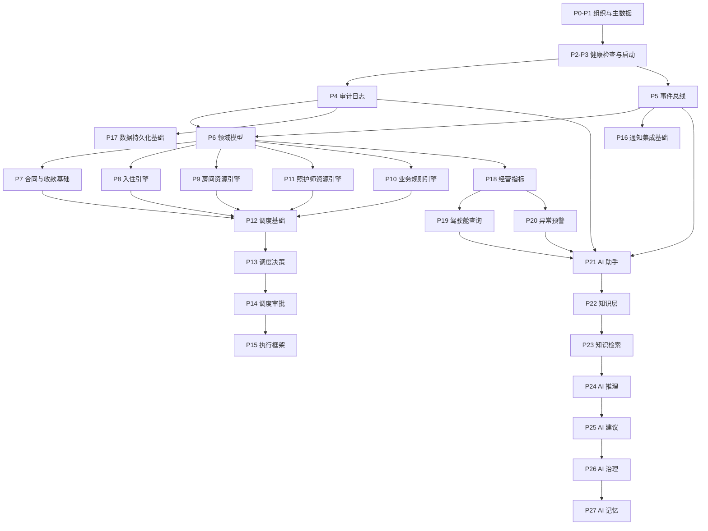

# OMS V1.0 架构复盘报告

## 一、当前完成模块总览

截至当前稳定节点，OMS V1.0 已完成 P0-P27。

| 阶段 | 模块 | 交付物 | 当前状态 |
| --- | --- | --- | --- |
| P0 | Organization | 组织结构与岗位基础 | 已完成 |
| P1 | Master Data | 主数据与身份基础 | 已完成 |
| P2 | Health Check | 启动健康检查 | 已完成 |
| P3 | Bootstrap | 系统启动引导 | 已完成 |
| P4 | Audit Log | 审计日志 | 已完成 |
| P5 | Event Bus | 事件总线 | 已完成 |
| P6 | Domain | 领域模型 | 已完成 |
| P7 | Contract + Payment | 合同与收款闭环基础 | 已完成 |
| P8 | Stay Engine | 入住生命周期引擎 | 已完成 |
| P9 | Room Engine | 房间资源引擎 | 已完成 |
| P10 | Business Rules Engine | 业务规则引擎 | 已完成 |
| P11 | Caregiver Engine | 照护师资源引擎 | 已完成 |
| P12 | Scheduling Foundation | 调度基础框架 | 已完成 |
| P13 | Scheduling Decision Engine | 调度决策引擎 | 已完成 |
| P14 | Scheduling Approval Engine | 调度审批引擎 | 已完成 |
| P15 | Execution Engine | 执行引擎框架 | 已完成 |
| P16 | Notification & Integration Foundation | 通知与集成基础 | 已完成 |
| P17 | Data Persistence Foundation | 数据持久化基础 | 已完成 |
| P18 | Metrics & Dashboard Foundation | 经营指标基础 | 已完成 |
| P19 | Dashboard Query Layer | 驾驶舱查询层 | 已完成 |
| P20 | Alert & Exception Engine | 异常预警引擎 | 已完成 |
| P21 | AI Assistant Foundation | AI 助手基础层 | 已完成 |
| P22 | Knowledge Layer | 知识层 | 已完成 |
| P23 | Knowledge Retrieval Foundation | 知识检索基础层 | 已完成 |
| P24 | AI Reasoning Layer | AI 推理层 | 已完成 |
| P25 | AI Recommendation Layer | AI 建议层 | 已完成 |
| P26 | AI Governance Layer | AI 治理层 | 已完成 |
| P27 | AI Memory & Learning Layer | AI 记忆与学习层 | 已完成 |

当前 V1.0 主线已经形成以下能力：

- 组织身份基础
- 领域对象基础
- 审计与事件基础
- 合同、入住、房间、照护师等核心资源引擎
- 调度分析、决策、审批、执行框架
- 通知、持久化、指标、查询、异常预警基础
- AI 查询、知识、检索、推理、建议、治理、记忆闭环

## 二、各模块状态

### 1. 已可生产使用

以下模块已具备稳定、可测试、可审计的基础能力，可作为生产系统底座使用：

| 模块 | 说明 |
| --- | --- |
| Master Data | 组织、人员、身份映射基础已稳定 |
| Health Check | 可判断系统启动前关键条件 |
| Bootstrap | 可执行基础启动引导，不进入业务执行 |
| Audit Log | Append-only 审计记录可用 |
| Event Bus | 同步事件发布与订阅基础可用 |
| Domain | 领域对象基础可用 |
| Room Engine | 房间生命周期与动作边界可用 |
| Stay Engine | 入住生命周期基础可用 |
| Caregiver Engine | 照护师资源基础可用 |
| Business Rules Engine | 规则评估基础可用 |
| Scheduler / Decision / Approval / Execution | 调度分析到授权执行框架可用 |
| Metrics / Dashboard Query | 经营指标与查询基础可用 |
| Alert Engine | 异常发现与状态流转基础可用 |
| AI Assistant / Knowledge / Retrieval / Reasoning / Recommendation / Governance / Memory | AI 基础能力链路可用 |

### 2. 基础能力

以下模块已经完成基础层，但仍属于框架能力，不等于生产外部系统已接通：

| 模块 | 当前能力 | 边界 |
| --- | --- | --- |
| Notification | 支持 `internal_log` 与 `feishu_mock` | 未接真实飞书发送 |
| Persistence | 支持 Local Storage / JSONL 追加存储 | 未接生产数据库 |
| Execution Engine | 支持授权后的模拟执行 | 不修改真实业务状态 |
| AI Recommendation | 生成可解释建议 | 不执行建议 |
| AI Governance | 管理建议审核生命周期 | 不自动审批、不自动执行 |
| AI Memory | 沉淀经验与反馈 | 不训练模型、不改规则 |

### 3. 待接真实数据

当前主线仍未完成生产级真实数据接入：

| 数据类型 | 当前状态 | 后续需要 |
| --- | --- | --- |
| 入住数据 | 有领域与引擎基础 | 需要真实数据源 Adapter |
| 房态数据 | 有 Room Engine | 需要生产房态数据接入 |
| 财务数据 | 有合同收款、指标基础 | 需要真实财务流水接入 |
| 销售数据 | 有领域与指标基础 | 需要真实销售数据接入 |
| 审批数据 | 有审批引擎基础 | 需要真实审批系统接入 |
| 通知数据 | 有 mock 通道 | 需要真实通知通道接入 |

### 4. 待扩展

以下能力建议在 V1.0 后续阶段扩展：

- 真实业务数据 Adapter
- 生产数据库 Adapter
- 服务层 API
- 权限边界统一校验
- 真实飞书生产适配
- 调度执行真实落地
- 经营驾驶舱 UI
- AI 与真实模型 API 的安全接入
- 生产部署、监控、告警与回滚机制

## 三、当前系统架构图



## 四、P0-P27 能力链路

### 1. 系统基础链路

```text
Organization
-> Master Data
-> Health Check
-> Bootstrap
-> Audit Log
-> Event Bus
```

能力结果：

- 系统有组织身份基础。
- 系统可启动前自检。
- 所有关键动作可审计。
- 所有关键动作可发布事件。

### 2. 业务资源链路

```text
Domain
-> Contract + Payment
-> Stay Engine
-> Room Engine
-> Caregiver Engine
-> Business Rules Engine
```

能力结果：

- 合同、入住、房间、照护师等业务资源有基础模型。
- 房间和入住等关键资源具备生命周期。
- 业务规则可被调度链路引用。

### 3. 调度执行链路

```text
Scheduling Request
-> Scheduling Context
-> Scheduling Result
-> Scheduling Decision
-> Scheduling Approval
-> Execution Request
-> Execution Result
```

能力结果：

- 调度链路具备分析、排序、审批、授权、执行框架。
- 当前执行阶段为模拟执行，不修改 Room / Stay / Caregiver。
- 决策链保留人工确认空间。

### 4. 经营感知链路

```text
Metrics
-> Dashboard Query
-> Alert Engine
-> Notification Foundation
```

能力结果：

- 经营指标可定义、生成 Snapshot、进入查询层。
- 异常可被规则发现并生成事件。
- 通知层已有路由基础，但暂未接真实发送。

### 5. AI 能力链路

```text
AI Query
-> AI Context
-> Knowledge
-> Knowledge Retrieval
-> Reasoning
-> Recommendation
-> Governance
-> Memory
```

能力结果：

- AI 可读取授权范围内 Context。
- 知识可分类、版本化、检索。
- 推理结果可解释、可追溯。
- 建议有依据、置信度、风险提示。
- 建议进入治理审核生命周期。
- 审核与执行反馈可沉淀为经验。

## 五、当前限制

当前 V1.0 主线是架构与基础能力完成，不等于生产全链路已经完全接通。

### 1. 无真实业务数据接入

当前引擎具备模型与流程能力，但没有完成生产级真实数据 Adapter。

限制：

- 未接真实入住数据源。
- 未接真实房态数据源。
- 未接真实财务流水。
- 未接真实销售系统。
- 未接真实审批系统。

### 2. 无正式 UI

P0-P27 主线没有将 UI 作为验收对象。

限制：

- 没有正式经营驾驶舱界面。
- 没有正式工作台页面。
- 没有正式审核操作页面。
- 没有正式 AI 查询页面。

说明：

- 仓库中存在早期 UI 相关模块，但不属于 P0-P27 稳定验收主线。
- 当前稳定主线以 Python 模块、测试、审计、事件和设计文档为准。

### 3. 无真实飞书生产适配

当前已有 Feishu 相关基础与 mock 通道，但真实生产适配未完成。

限制：

- 通知层未接真实飞书 API。
- 审批未接真实飞书审批。
- 身份、消息、任务等生产接口仍需适配。

### 4. 无生产数据库

当前持久化层是 Local Storage / JSONL 基础。

限制：

- 未接 PostgreSQL / MySQL / SQLite 生产库。
- 未建立迁移机制。
- 未建立备份、恢复、索引、并发控制。

### 5. 未形成应用服务层

当前多数模块是领域引擎和基础设施层。

限制：

- 尚无统一 Application Service。
- 尚无统一 API Gateway。
- 尚无跨模块事务边界。
- 尚无生产权限网关。

### 6. AI 不接真实模型

P21-P27 明确不接真实 AI API。

限制：

- AI 输出仍为 mock / rule-based / framework level。
- 不具备真实自然语言理解与生成能力。
- 不能自动训练、自动执行、自动改规则。

## 六、下一阶段建议：P28-P30 路线

### P28：Application Service Layer

目标：

建立统一应用服务层，把 P0-P27 的分散引擎收口成可调用的业务用例。

建议内容：

- 定义 `ApplicationService`
- 定义统一 Command / Query 边界
- 建立权限校验入口
- 建立 Audit / Event 标准调用模板
- 将调度、指标、异常、AI 查询形成服务级入口

边界：

- 不接 UI。
- 不接生产数据库。
- 不修改既有引擎核心逻辑。

价值：

- 解决“模块已完成，但还不是统一应用”的问题。

### P29：Production Adapter Layer

目标：

建立真实外部系统接入层。

建议内容：

- 数据源 Adapter
- 真实飞书 Adapter
- 持久化 Adapter
- 文件导入 Adapter
- 外部接口错误降级策略
- pending / retry / dead-letter 基础

边界：

- 不做业务算法扩展。
- 不做 UI。
- 不改变领域引擎。

价值：

- 解决“基础能力完整，但未接真实生产环境”的问题。

### P30：Release Readiness Gate

目标：

建立生产发布前的验收闸门。

建议内容：

- 全量测试门禁
- Bootstrap + Health Check 发布门禁
- Audit / Event 覆盖率检查
- 配置完整性检查
- 数据 Adapter 可用性检查
- 回滚策略
- 运行监控基础

边界：

- 不新增业务功能。
- 不做 UI。
- 不做模型训练。

价值：

- 解决“系统能运行，但尚未形成可发布生产包”的问题。

## 七、V1.0 总结

OMS V1.0 当前已经完成企业操作系统的基础骨架：

- 有组织身份。
- 有领域模型。
- 有审计与事件。
- 有核心资源引擎。
- 有调度、决策、审批、执行框架。
- 有通知、持久化、指标、查询、异常基础。
- 有 AI 查询、知识、检索、推理、建议、治理、记忆闭环。

当前仍不应直接宣称为完整生产业务系统。

更准确的状态定义：

```text
OMS V1.0 = Production-grade Foundation Architecture
Status = P0-P27 stable
Ready for = Application Service + Production Adapter + Release Gate
Not yet = Full production business operation
```
