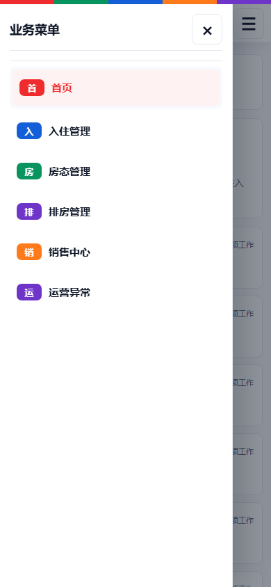
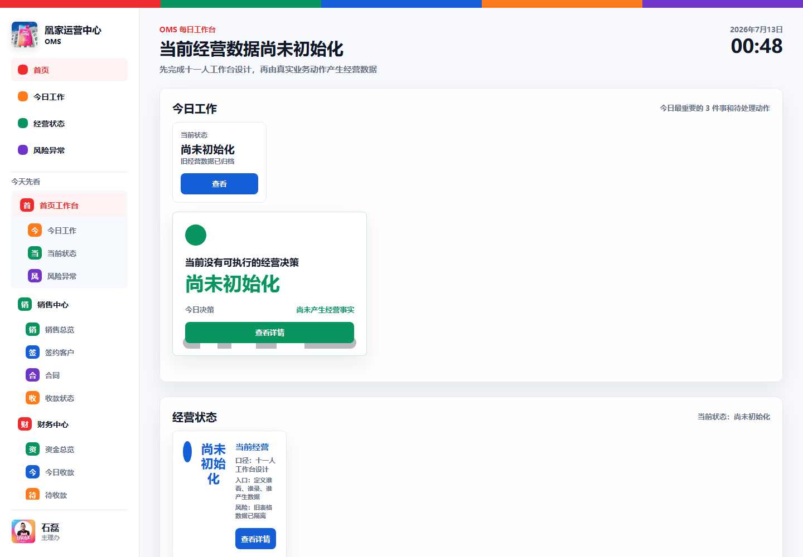

# OMS手机端公共界面返工验收报告

日期：2026-07-13

## 一、返工结论

本轮已完成公共移动端框架的代码返工与移动视口验收。手机端不再复用桌面内容壳，而是使用独立移动根节点、一级菜单页、二级任务页。

当前结论：

- 本地移动视口与自动交互验证：完成，仅作为开发验证。
- EMP001 石磊移动工作台：已部署，飞书真实入口未验收。
- EMP008 刘芳羽移动工作台：已部署，飞书真实入口未验收。
- 真实飞书电脑端截图：未取得。
- 真实飞书手机端截图或录像：未取得。
- 石磊飞书手机端确认：否。
- 最终状态：已部署待验收，不得标记通过，不得发布正式版本。

## 二、修复前问题

修复前视频反馈对应的问题为：桌面固定侧栏占据手机宽度、正文形成窄条、文字被迫逐字换行、父子菜单混排、点击菜单仅滚动桌面长页面。

根因包括：

1. 手机端仍使用桌面 `.app-shell` 与桌面页面区。
2. 父菜单和子菜单共用桌面业务路由。
3. 样式表存在三处未闭合规则，移动媒体查询未被浏览器正确解析。
4. 手机端没有独立页面根节点与父子页面状态。

## 三、重构结果

### 公共移动框架

- 新增独立 `mobileWorkspaceRoot`。
- 手机端隐藏全部桌面正文区，桌面侧栏关闭时完全移出视口。
- 顶部仅保留返回、页面标题、菜单按钮。
- 抽屉只显示当前员工有权限的一级菜单。
- 一级菜单进入 `mobile-menu` 二级菜单页。
- 二级菜单进入 `mobile-task` 单任务页。
- 手机返回规则：任务页 → 所属一级菜单页 → 首页。
- 卡片、表单、按钮全部采用单列触控布局。

### EMP001 石磊

一级菜单实测：

- 首页工作台
- 销售中心
- 财务中心
- 运营中心
- 审批与授权
- 数据追溯
- 经营分析助手

点击路径实测：`销售中心 → 合同`，最终标题为“合同”，身份为“石磊 · 主理办”。

### EMP008 刘芳羽

一级菜单实测：

- 首页
- 入住管理
- 房态管理
- 排房管理
- 销售中心
- 运营异常

点击路径实测：

- `入住管理 → 当前入住`
- `排房管理 → 未来排房总览`

身份显示为“刘芳羽 · 店总 + 销售”。

## 四、截图证据

### 石磊

### 刘芳羽

### 电脑端回归

## 五、宽度与中文扫描

移动视口：390 × 844。

- 石磊页面：正文宽度 390，视口宽度 390。
- 刘芳羽页面：正文宽度 390，视口宽度 390。
- 关闭抽屉时桌面侧栏位移：-352.16 像素，不占正文布局。
- 打开抽屉时仅显示一级菜单，二级菜单不在抽屉中混排。
- 石磊“合同”页面可见英文扫描：0。
- 刘芳羽“当前入住”页面可见英文扫描：0。
- “OMS”为唯一允许的英文字母展示。

## 六、测试结果

- JavaScript 语法检查：通过。
- 手机框架与契约专项测试：23/23 通过。
- 自动点击路径：2/2 通过。
- 样式块完整性检查：通过，316 个开始块与 316 个结束块。
- 全量测试：416 项中 415 项通过；原有 Bootstrap 测试 1 项失败，与本轮移动端代码无关。

## 七、真实飞书录像状态

当前没有伪造飞书手机端操作录像。需要 BOSS 使用真实飞书账号分别完成任务书中的石磊与刘芳羽操作路径并录屏。该项完成前：

- 不标记最终飞书验收通过。
- 不提交正式版本。
- 不继续开发其他员工工作台。

## 八、代码状态

本轮修改尚未提交。静态资源版本为 `mobile-shell-v2-20260713`，用于避免飞书继续加载旧移动端资源。

## 九、飞书静态入口发布记录

首次本地验收后，BOSS反馈飞书手机端没有变化。复查确认飞书实际入口仍加载旧的 `gh-pages` 静态版本 `emp008-workbench-v1-20260712-2`，此前本地验收不能代表飞书已更新。

2026-07-13 已将本轮验收前端发布到飞书实际使用的 GitHub Pages：

- 飞书前端入口：`https://ponslucia14-ux.github.io/huangjia-oms-v1/`
- `gh-pages` Commit：`06ef7f397f1f4defe6eac516a46854774bb3f3ca`
- 在线静态资源版本：`mobile-shell-v2-20260713`
- 在线 `index.html`：已包含 `mobileWorkspaceRoot`
- 在线 `app.js`：已包含一级菜单页与二级任务页渲染函数
- 在线 `styles.css`：已包含手机端隐藏桌面壳与抽屉规则

本次只发布飞书验收静态前端，没有创建正式 Release。BOSS仍需彻底关闭飞书 OMS WebView 后重新进入完成实机复验。
